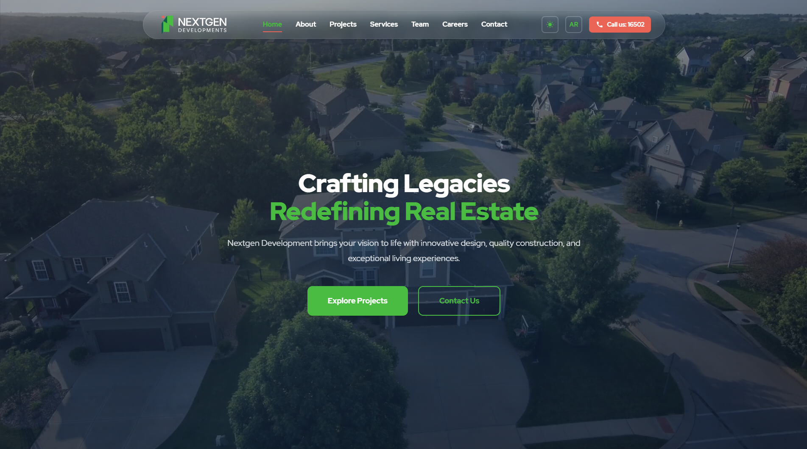

# Nextgen Development Website

A modern, high-performance real estate development website built with **React** and **Vite**. This project showcases Nextgen Development's portfolio, services, and team with a focus on user experience, responsiveness, and bilingual support (English & Arabic).



## 🚀 Features

- **Modern & Responsive UI**: Fully responsive design that works seamlessly across desktops, tablets, and mobile devices.
- **Bilingual Support (i18n)**: Complete Arabic and English translations with tailored layouts (RTL/LTR support).
- **Dynamic Project Portfolio**: Browse projects with filtering capabilities (Residential, Commercial, Mixed-use).
- **Interactive Details**: Dedicated project pages with image galleries, specifications, and amenity lists.
- **Animated Interactions**: Smooth scroll animations and interactive elements for an engaging user experience.
- **Theme Support**: Built-in support for Light and Dark modes.
- **Contact Integration**: Functional contact forms and embedded Google Maps for location finding.

## 🛠️ Tech Stack

- **Framework**: [React](https://react.dev/) (v19)
- **Build Tool**: [Vite](https://vitejs.dev/)
- **Routing**: [React Router](https://reactrouter.com/) (v7)
- **Styling**: Native CSS with Variables & Flexbox/Grid
- **Linting**: ESLint

## 📦 Getting Started

Follow these steps to set up the project locally.

### Prerequisites

- Node.js (v18 or higher)
- npm (v9 or higher)

### Installation

1.  **Clone the repository**
    ```bash
    git clone https://github.com/your-username/nextgen-development-website.git
    cd nad_web
    ```

2.  **Install dependencies**
    ```bash
    npm install
    ```

3.  **Run the development server**
    ```bash
    npm run dev
    ```
    The application will be available at `http://localhost:5173`.

### Building for Production

To create a production-ready build:

```bash
npm run build
```

This will generate optimized static assets in the `dist` directory.

## 📂 Project Structure

```
nad_web/
├── public/              # Static assets (images, icons, etc.)
├── src/
│   ├── components/      # Reusable UI components (Navbar, Footer, etc.)
│   ├── context/         # React Context (LanguageContext, etc.)
│   ├── data/            # Static data files (projects.js, team.js)
│   ├── i18n/            # Translation files
│   ├── pages/           # Page components (Home, About, Projects, etc.)
│   ├── App.jsx          # Main application component
│   └── main.jsx         # Entry point
├── index.html           # HTML entry point
├── package.json         # Project dependencies and scripts
└── vite.config.js       # Vite configuration
```

## 🤝 Contributing

1.  Fork the repository
2.  Create your feature branch (`git checkout -b feature/AmazingFeature`)
3.  Commit your changes (`git commit -m 'Add some AmazingFeature'`)
4.  Push to the branch (`git push origin feature/AmazingFeature`)
5.  Open a Pull Request

## 📄 License

This project is licensed under the MIT License - see the [LICENSE](LICENSE) file for details.

---

**Nextgen Development** - Building Excellence, Creating Communities.
